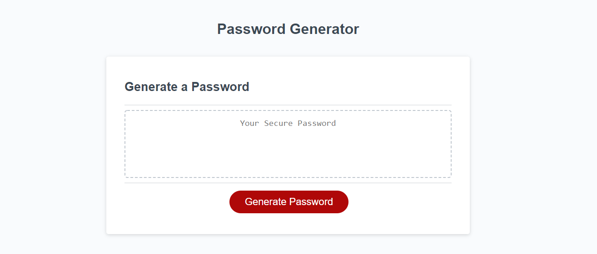

# Password Generator
Password Generator is a tool that generates a password based on the users response to the given requirements. The requirements that the users must specify are simple:
* Password length - The generated password must be at least 8 characters in length and no more than 128 characters in length.
* Character Types - The generated password must include at least one of the following character types specified by the user: Uppercase, Lowercase, Numeric, and/or Special Characters.

To accomplish this, I was given starter code that initialized a function to kick off  prompts for the user to respond to. I then implemented my own functions to satisfy the requirements of this challenge. Some issues that I had to cover in this challenge included:

* Dealing with invalid user inputs such as null inputs and typos.
* Working with recursive functions in the case of invalid user input, and making sure that all values are overwritten correctly in the case of a recursive function.
* Creating a function that randomized both the character type, depending on what the user requests, as well as a specific character for the generated password, in random order.

## How to use this tool:
To see my finished product, visit [here](https://adairconlin.art/password-generator/)
The page will look like this:

All you have to do it select "Generate Password" and follow the prompts to specifiy what you want in your password!
